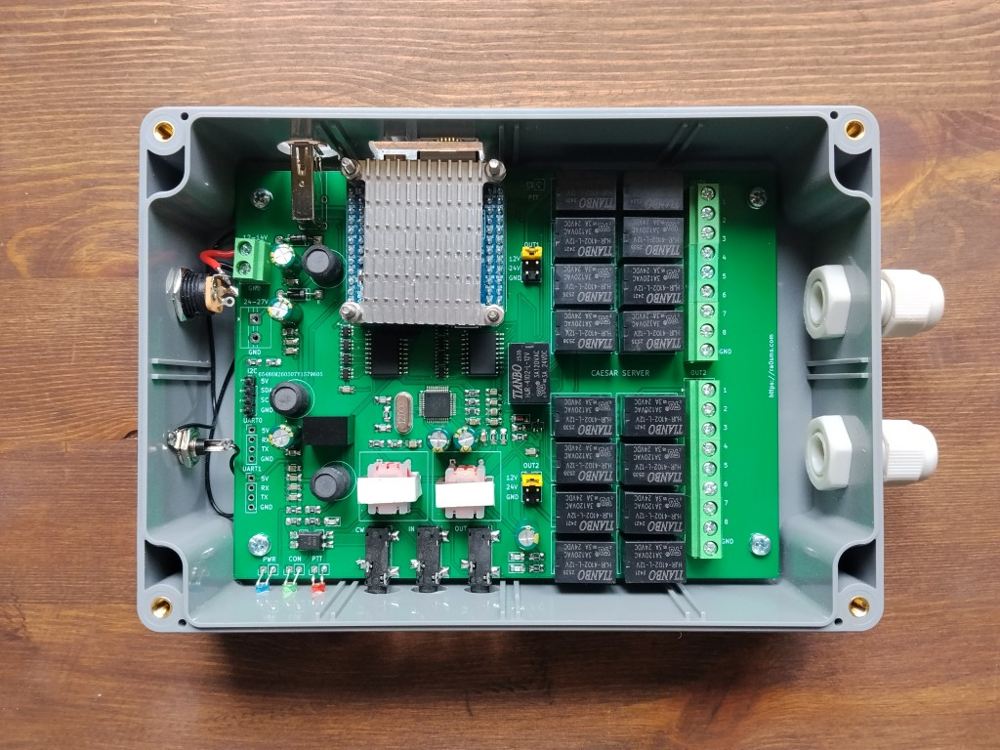
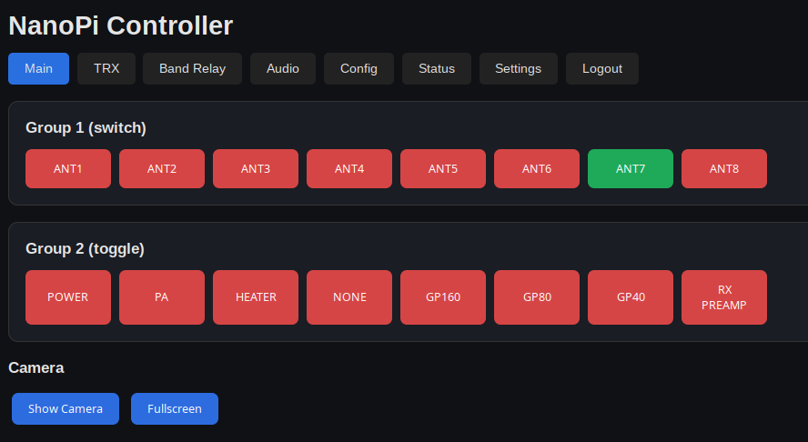
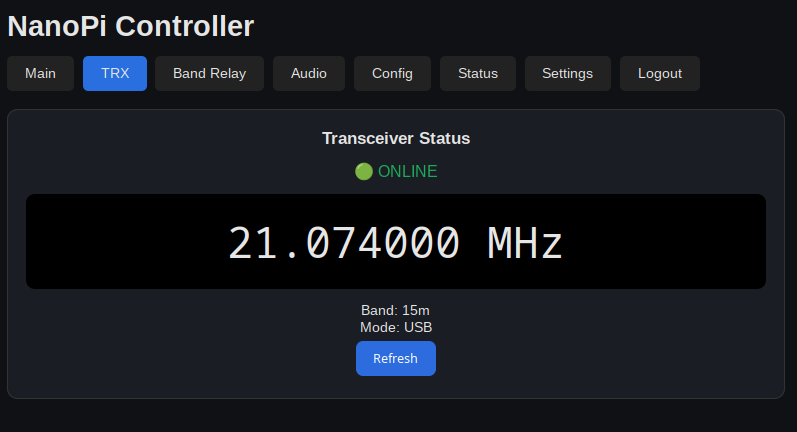
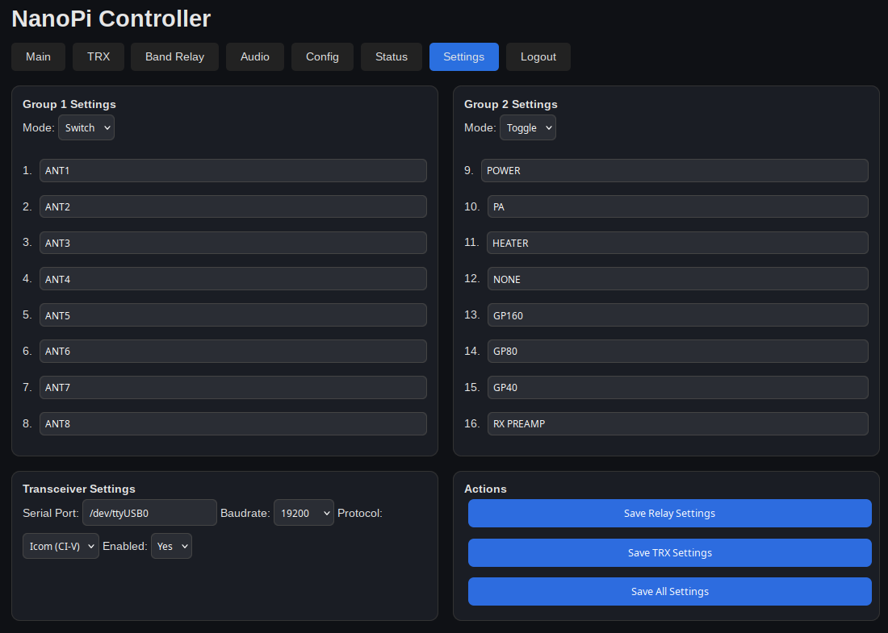

# Nano Server — Remote Radio Station Server

**Nano Server** is a server-side component of a remote ham radio station system. It runs on a **NanoPi NEO** single-board computer with **Armbian** and provides audio streaming, PTT control via GPIO, video streaming, relay switching, CAT interface forwarding, and a web-based configuration interface.

Desktop client software: https://github.com/ra0sms/caesar-client-desktop



---

## Features

- 🎙️ **Bidirectional audio** over UDP (GStreamer + Opus codec)
- 📡 **PTT control** via GPIO with client reachability monitoring
- 📷 **Video streaming** via mjpg-streamer (MJPEG over HTTP)
- 🔌 **Relay control** via I2C (2×PCF8574T, 16 relays total)
- 🌐 **Web interface** — relays, TRX, audio, config, status, band relay rules (single UI on port 5050)
- 🔗 **CAT interface** forwarding over TCP (Icom CI-V and Kenwood protocols)
- 🔒 **Fail-safe** — PTT is forced OFF when client disconnects
- 🎛️ **Band Relay Rules** — automatic relay switching based on transceiver frequency

---

## Hardware

| Component | Details |
|---|---|
| SBC | NanoPi NEO (Allwinner H3) |
| OS | Armbian (Debian Bookworm or later) |
| Audio | USB sound card (C-Media USB Audio Device) |
| Camera | USB webcam on `/dev/video1` |
| Relay board | 2× I2C GPIO expander at `0x20` / `0x21` |
| CAT interface | USB-to-Serial on `/dev/ttyCAT` |
| CON LED | GPIO PC2 (line 66) |
| PTT output | GPIO PC3 (line 67) |

---

## Architecture

```
Client PC                          NanoPi NEO (Server)
─────────────────────────────────────────────────────────
                    UDP :5000  ←──  Audio TX (mic → client)
                    UDP :5000  ──→  Audio RX (client → speaker)
                    UDP :5001  ──→  PTT commands (0/1)
                    UDP :5002  ←→   Ping / RTT monitoring
                    TCP :5050  ←──  Web UI (Flask): relays, TRX, audio, config, status, band relay
                    TCP :8081  ←──  MJPEG video stream
                    TCP :3001  ←──  CAT (Icom CI-V or Kenwood)
```

### Systemd services

| Service | Description |
|---|---|
| `ptt_server` | PTT GPIO control + client monitor + ping responder |
| `audio_server` | GStreamer audio TX (server mic → client) |
| `audio_client_on_server` | GStreamer audio RX (client → server speaker) |
| `relay-web` | Web UI: relays, TRX, audio, config, status, band relay (port 5050) |
| `mjpeg-streamer` | MJPEG video stream from USB camera |
| `alsa_restore` | Restores ALSA mixer state at boot |

---

## Installation

### 1. Flash Armbian to SD card and boot NanoPi NEO

### 2. Clone the repository

```bash
git clone https://github.com/ra0sms/nano-server.git
cd /home/pi/nano-server
```

### 3. Run the install script as root

```bash
sudo bash install_server.sh
```

The script will:
- Install all required packages (GStreamer, Flask, gpiod, mjpg-streamer, etc.)
- Build and install **mjpg-streamer** from source
- Create `client_ip.cfg`, `server_ip.cfg`, and `web/password.txt` with defaults
- Configure hardware overlays in `/boot/armbianEnv.txt`
- Register and start all systemd services
- Add sudoers entries for `restart_services_on_server.sh` and `systemctl restart relay-web`

### 4. Set IP addresses

```bash
echo '192.168.1.100' > /home/pi/nano-server/client_ip.cfg   # IP of the client PC
echo '192.168.1.10'  > /home/pi/nano-server/server_ip.cfg   # IP of this server
```

Or use the web interface at `http://<server-ip>:5050/`.

### 5. Change the default password for the web panel

```bash
echo 'yourpassword' > /home/pi/nano-server/web/password.txt
```

### 6. Set up the CAT USB port udev symlink (with transceiver connected)

```bash
sudo bash /home/pi/nano-server/fix_usb_ports.sh
```

### 7. (Optional) Fix ALSA card order

If you have multiple USB audio devices (e.g., webcam with mic), the C-Media USB Audio card may not be card 0. Run:

```bash
sudo bash /home/pi/nano-server/fix_alsa_card_order.sh
sudo reboot
```

### 8. Reboot

```bash
sudo reboot
```

---

## Armbian Hardware Configuration

The script `setup_armbian_env.sh` patches `/boot/armbianEnv.txt` to enable the required device tree overlays. It **never modifies** `rootdev` or `rootfstype` so the system remains bootable.

To apply manually on a running system:

```bash
sudo bash /home/pi/nano-server/setup_armbian_env.sh
sudo reboot
```

Required overlays: `i2c0 uart1 uart2 uart3 usbhost0 usbhost1 usbhost2 usbhost3 w1-gpio`

---

## Web Interface — port 5050

Access at `http://<ip>:5050/` (password protected).
Default password: `1234` — change it in `web/password.txt`.

| Tab | Description |
|---|---|
| Main | Relay switching (16 relays, toggle/switch modes) and camera view |
| TRX | Transceiver frequency, band, mode display |
| **Band Relay** | **Frequency-based automatic relay switching rules** |
| Audio | Speaker and mic level control via ALSA |
| Config | IP addresses, audio stream settings, profiles, restart services |
| Status | Client RTT / connection status, local IP |
| Settings | Relay names, group modes, TRX serial port and protocol |

### Band Relay Rules

Configure which relays activate for each frequency range (in kHz). Rules use `from ≤ freq < to` logic (lower bound inclusive, upper bound exclusive). To avoid gaps, set `to` of one rule equal to `from` of the next.

Example:
- `1800-1840` kHz → relays 1, 2
- `1840-1900` kHz → relays 3, 4
- `7000-7300` kHz → relays 5, 6

Auto-switching can be toggled on/off via a checkbox in the Band Relay tab.







---

## Profiles

Up to 5 configuration profiles (server IP, client IP, audio settings) can be saved and loaded from the web configuration interface. Profile files are stored in `profiles/`.

---

## Restarting Services

To restart all runtime services at once:

```bash
sudo /home/pi/nano-server/restart_services_on_server.sh
```

Or restart individual services:

```bash
sudo systemctl restart ptt_server.service
sudo systemctl restart audio_server.service
```

To restart the web panel from the UI, use the **"Restart Web Panel"** button on the Config tab (requires sudoers NOPASSWD for `systemctl restart relay-web`).

To reload `client_ip.cfg` without restarting the PTT service:

```bash
sudo systemctl kill -s SIGHUP ptt_server.service
```

---

## Audio Configuration

Edit `audio/audio_config.cfg`:

```ini
RATE=48000       # sample rate: 48000 or 24000 Hz
LATENCY=100000   # buffer time in microseconds (100 ms)
```

Or use the **Configuration** page in the web UI.

The web panel auto-detects the ALSA card (looks for C-Media USB Audio in `/proc/asound/cards`) and the speaker control name. Mic capture is hardcoded to `numid=8` (`Mic Capture Volume`).

---

## Project Structure

```
nano-server/
├── install_server.sh              # Main installation script
├── setup_armbian_env.sh           # Patches /boot/armbianEnv.txt safely
├── restart_services_on_server.sh  # Restart all runtime services
├── fix_usb_ports.sh               # Create /dev/ttyCAT udev symlink
├── fix_alsa_card_order.sh         # Fix USB audio card order via modprobe
├── setup_sudo_nopasswd.sh         # Configure sudoers for web panel self-restart
├── create_ser2net_yaml.sh         # Generate ser2net config
├── client_ip.cfg                  # Client IP (git-ignored)
├── server_ip.cfg                  # Server IP (git-ignored)
├── armbianEnv.txt                 # Reference overlay config
├── audio/
│   ├── audio_server.sh            # GStreamer TX pipeline
│   ├── audio_client_on_server.sh  # GStreamer RX pipeline
│   └── audio_config.cfg           # Rate and buffer settings
├── network/
│   └── combined_ptt_service.py    # PTT + ping monitor + ping responder
├── web/
│   ├── app.py                     # Web UI: relays, TRX, audio, config, status, band relay
│   ├── config.json                # Relay names and group modes
│   ├── trx_config.json            # TRX serial port and protocol settings
│   ├── band_rules.json            # Band relay frequency rules
│   └── password.txt               # Web UI password (git-ignored)
├── systemd/                       # Service unit files
├── profiles/                      # Saved configuration profiles (git-ignored)
└── docs/
    ├── gpio-info.txt              # GPIO line numbers reference
    └── nano-pinout.jpg            # NanoPi NEO pinout diagram
└── KiCad/                         # KiCad schematic and PCB files   
```

---
